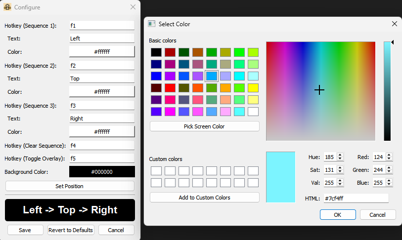

PoE Maven Memory Game Helper

A simple, customizable hotkey overlay to help with memory games, such as the Maven's memory game in Path of Exile. It displays a sequence of text on screen, controlled by global hotkeys.
How it Works

The application is controlled by five main actions, which are assigned to hotkeys (F1-F5 by default).

    Sequence 1, 2, 3 (F1, F2, F3): Pressing these hotkeys adds their corresponding value ("Left", "Top", "Right") to the sequence displayed on the overlay.

    Clear Sequence (F4): Pressing this hotkey clears all items from the sequence.

    Toggle Overlay (F5): Pressing this hotkey enables or disables the overlay completely.

Features

    Customizable Hotkeys: Assign any keyboard key or combination (e.g., f1, shift+x, ctrl+alt+5) to actions.

    Customizable Text: Change the text displayed for each sequence item (e.g., change "Left" to "Blue").

    Customizable Colors: Set individual font colors for each sequence item and a custom background color for the overlay.

    Adjustable Position: Visually drag and drop the overlay to any position on your screen.

    System Tray Icon: Runs quietly in the system tray with a right-click or double-click menu for easy access to configuration.

    Persistent Settings: All your customizations are automatically saved in %appdata% as config.json.

Installation

    Download the PoE Maven Memory Game Helper.exe from the Releases page.

    Place the .exe file anywhere on your computer (e.g., your Desktop).

How to Use

    Run the .exe file. An icon will appear in your system tray.

    Right-click or double-click the system tray icon to open the configuration window.

        Disable/Enable Overlay: Toggles the overlay visibility.

        Configure: Opens the main settings window.

        Quit: Closes the application.

Configuration Window

    Hotkeys: Click the input box next to an action and press your desired key combination.

    Text: Type your desired text for each sequence item.

    Colors: Click the colored buttons to open a color picker.

    Set Position: Click this to open a draggable window. Move it to your desired location and click "OK".

    Save: Saves your settings and applies them immediately.

    Revert to Defaults: Resets all settings to their original state.

    Cancel: Closes the window without saving.

Tips for Gaming Mice/Keyboards

You can assign actions to special buttons on your gaming hardware (e.g., G-keys, extra mouse buttons).

    Open your mouse/keyboard's software (Razer Synapse, Logitech G Hub, etc.).

    Remap the special button you want to use to an unused keyboard key, such as F13 through F24. These keys are perfect as they don't exist on most keyboards and won't cause conflicts.

    Open the Helper's configuration window.

    Click the input box for the action you want to set.

    Press the special button on your mouse or keyboard. The application will register it as f13 (or whichever key you assigned).

    Click Save.

License

This project is licensed under the MIT License.

Copyright (c) 2025 rami1337

Permission is hereby granted, free of charge, to any person obtaining a copy
of this software and associated documentation files (the "Software"), to deal
in the Software without restriction, including without limitation the rights
to use, copy, modify, merge, publish, distribute, sublicense, and/or sell
copies of the Software, and to permit persons to whom the Software is
furnished to do so, subject to the following conditions:

The above copyright notice and this permission notice shall be included in all
copies or substantial portions of the Software.

THE SOFTWARE IS PROVIDED "AS IS", WITHOUT WARRANTY OF ANY KIND, EXPRESS OR
IMPLIED, INCLUDING BUT NOT LIMITED TO THE WARRANTIES OF MERCHANTABILITY,
FITNESS FOR A PARTICULAR PURPOSE AND NONINFRINGEMENT. IN NO EVENT SHALL THE
AUTHORS OR COPYRIGHT HOLDERS BE LIABLE FOR ANY CLAIM, DAMAGES OR OTHER
LIABILITY, WHETHER IN AN ACTION OF CONTRACT, TORT OR OTHERWISE, ARISING FROM,
OUT OF OR IN CONNECTION WITH THE SOFTWARE OR THE USE OR OTHER DEALINGS IN THE
SOFTWARE.